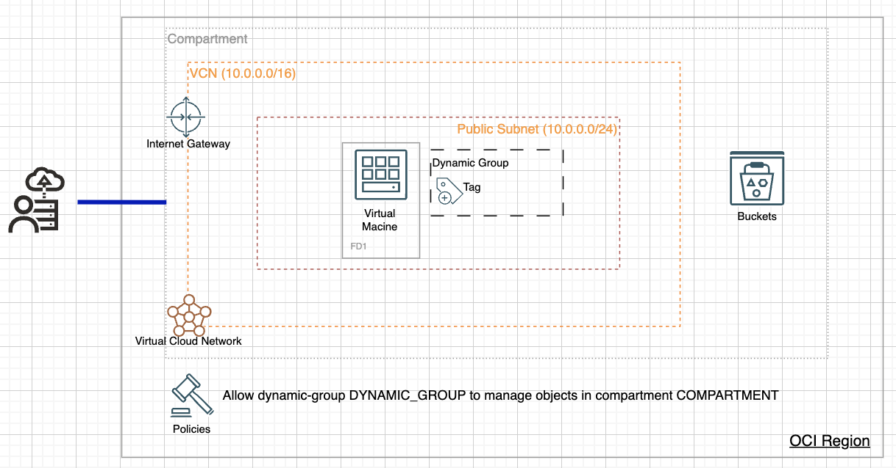

# oci-lab-uploadobject
A lab to show how to setup a python flask to upload files to OCI object storage bucket without any keys and secrets

This is a demo to show a life usecase to allow endusers upload files to OCI Object Storage Bucket

Create a compute instance
Remember to add NSG

python --version
sudo pip3 install virtualenv
sudo pip3 install flask
sudo yum install python36-oci-sdk

pip3 show virtualenv
python /usr/local/lib/python3.6/site-packages/virtualenv venv
source venv/bin/activate

sudo firewall-cmd --zone=public --permanent --add-port=5000/tcp
sudo systemctl reload firewalld
sudo firewall-cmd --list-all

git clone https://github.com/williewoo/oci-lab-uploadobject.git